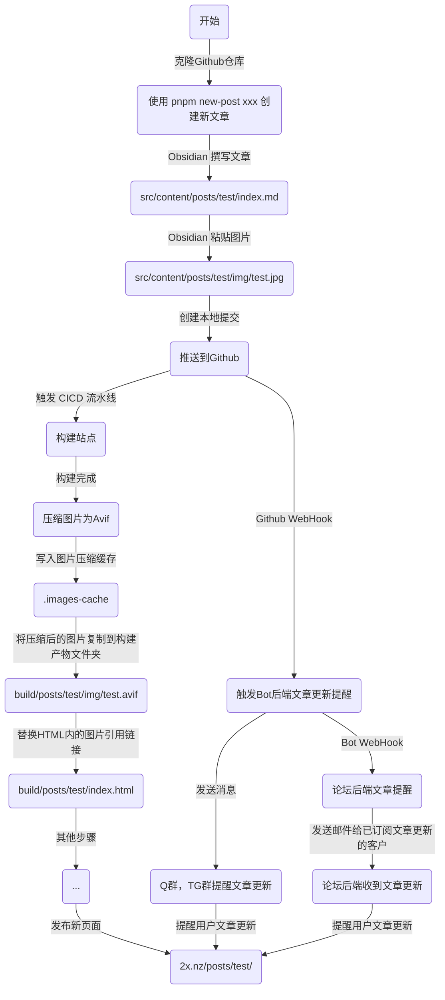

# 为什么要重构为纯Svelte？
这实际上是个复杂的问题。在2024年选择Fuwari作为本站框架实际上只是一个巧合，当时并没有顾虑到后续开发的问题，我当时甚至是从 Hugo/PaperMod 这种明显比Astro高效的框架迁移过来的。当时选择Fuwari只有一个原因：**好看** 

我们可以来简单看一看Fuwari Demo Site


放眼望去，第一个感觉就是大。相比于传统的博客站，Fuwari的设计语言明显是更现代，更灵动的，因为Fuwari还采用了Swup来做SPA页切，这使得网站从一开始的进入，再到用户主动切换页面，都是非常丝滑流畅的


另外，由于它基于Astro SSG，这使得它的SEO也是非常棒的，所有页面都是静态的HTML，无需服务端介入，即可同时实现：**美观、SEO良好、快速** 的博客站

可见，我一直都在夸Fuwari，那我为什么要换掉它呢？

实际上，并不是Fuwari不好，而是本站渐渐从一个 **纯静态博客站** 逐渐变为了 **重客户端的全栈** ，尤其是2026年上半年，我们添加了非常多根本不属于静态博客的东西

如果说在博客上扔个课表还是一个方便自己的快捷方式，勉强算合理


那么在博客上扔一个 **论坛** 则是一个完全改变项目定位的做法，Astro SSG并不擅长处理全栈，所以便使用了 `@astrojs/svelte` 来实现这种重客户端交互的页面


但是做着做着便发现不对劲了。由于 Fuwari 使用 Swup 来操作页切，而经过我们长达2年的魔改，Astro 引以为傲的 island 我们根本没用，大部分页面都是采用的传统的监听器，页面上哪些是全局JS？哪些是只需要加载一次的JS？哪些又是持久化的JS？

我不知道，所以这导致在后续开发十分痛苦。经常会出现新做了一个页面，第一次进去正常，然后被Swup接管后，来回切几次，页面布局就崩了，某些关键DOM被抽走了

这并不是一个新问题，而是一个遗留问题，由于在2024年我刚使用该项目的时候并不具备这些基础，慢慢的，聚沙成塔，聚史成山。如果现在想要将这些诡异的写法通通移除，无异于重写Fuwari的渲染器，需要分析并重构200+文件，近w行代码

我改不动，于是在忍无可忍的时候，我采用了头痛砍头，脚痛砍脚的方式。

*既然没法重构，那直接不用Swup了，全部删了，这总很简单吧？*

的确，就像脱衣服简单穿衣服难，删除Swup非常简单，如果你不追求工业级剔除，只需要在Astro中禁用Swup，并全局拦截Swup的load即可

但是...代价是什么呢？代价就是一旦没有了Swup，网站将不再是SPA，所有的页面切换都需要 **完整重新拉取** 一份新的HTML替换当前页面。*就像大学编程课写的那些 1.html 2.html 然后使用 a 标签跳转那样* 

这会导致两个问题，第一个问题是显而易见的，用户会发现，在页面切换的时候好像变得古典了，点完超链接跳转后会有一瞬间白屏，然后内容才会慢慢加载出来，而且我单页上的JS本来就很多，这会导致你无论前往何页面，都会看到页面上 **砰砰砰** 逐步加载出：文章，课程表，直播状态，访问量

它十分割裂，且用户体验极差。同时，它也会导致第二个问题，那就是资源浪费。假设用户只想点开一篇文章阅读，无SPA的页面会将新HTML完全替换旧的HTML。这不仅会导致页面重新加载拖慢了浏览器的性能，由于我们接入了访问量回显以及各式各样的客户端探针。这些东西本身只需要在一个用户会话中加载一遍，但由于无SPA，会导致重复加载这些内容，这无疑隐性提高了后端服务器的负载 

*想一下你进入首页，加载首页8篇文章的访问量，加载一个课程表组件，再查询一下二叉树树当前是否开播，好，加载完了。接下来，点进一篇文章，那么就又要加载一下这个文章的访问量，同时，加载一个课程表组件，再查询一下二叉树树当前是否开播，好，加载完了。最后，你看完文章了，想回到首页看其他文章，你点击了首页按钮，跳转到首页，此时页面又会重新加载首页8篇文章的访问量，加载一个课程表组件，再查询一下二叉树树当前是否开播，好，加载完了。*

是不是光看着就要力竭了？实际上浏览器和后端服务器比你更力竭。这些内容原本应该遵循 **按需加载** 。如课程表组件加载完成后就持久化，当你点进某篇文章浏览量应该是立即显示的，因为上一个页面是文章列表，肯定已经得到浏览量了，无需再次获取...

诸如此类的问题导致后续的开发虽然很爽，但是用户体验很烂，调研问卷有大多数反馈国内网络加载慢的问题。这就是因为没有SPA，所有页面都需要完整拉取HTML，由于我们的服务器在Cloudflare，尽管已经优选，但可能还是较慢。如果是SPA，只需拉取新的内容，并且也不会触发浏览器的重加载。不管是在实际资源加载还是用户体感都是更快的


然后，便是Astro臭名昭著的内建图片压缩，我曾经在 [禁用Astro跟弱智一般的静态构建图像优化 - 《二叉树树》官方网站](https://2x.nz/posts/disable-astro-generating-optimized-images/) 写过如何禁用它，因为它不仅将所有压缩压力都传递给了CICD，而且它的结果也不尽人意，有时候，甚至会反向压缩


如何禁用它呢？可以，但很诡异，要不你将图片放到 `/public` 目录，Astro就不会管他了，但是编辑器就不认图了。要不你就写一个补丁，在源码层面将Astro图片压缩的代码剔除（旧站就是这么做的）。总之，Astro就是强制爱，就是不管怎样都想看看你的图片，顺便用Shrap一压，*欸！一不小心压少了，压多了2kb*

再接着，经过这几个月的超级周边功能开发，我们实现了一堆奇奇怪怪的功能


而这些功能无一例外都是 **Svelte** 。这更代表了整个项目已经被 Svelte 架空了，那么，不如贯彻到底，直接把Astro丢了吧？


# 迁移！抉择架构！

那么既然要迁移，一开始我其实并没有直接就开一个新的Svelte项目，而是在参考各大框架，比如 Next.js，Nuxt.js，Vue 等。但最终还是用了Svelte，准确来说，是SvelteKit

最主要的原因就是本身旧项目里的大部分组件就已经是Svelte写的了，如果换语言，无疑是需要跨语言重构的，多一事不如少一事

好，我们现在已经确定了新项目的框架，这就等于有了一栋楼的基底和骨架，那么这栋楼应该长什么样子呢？

我首先就想到了曾经开发独立论坛所用的UI组件库：**shadcn** 。它是个老牌，企业级的，现代的，包括Vercel在内的各大厂都在使用的一套UI组件库

不过原生的shadcn是和Next.js一起出来的，所以它的写法是JSX，有虚拟DOM，而SvelteKit没有虚拟DOM，也不用JSX

好在，Svelte有专门适配和优化过的shadcn：[The Foundation for your Design System - shadcn-svelte](https://www.shadcn-svelte.com/) ，那么，UI也敲定了，我们就可以开始重构我们的站点并迁移了

# 约束！防止史山！
接下来，我首先将 https://github.com/afoim/fuwari 仓库的状态转为 **公共存档（Public Archive）** 一方面，这么做能防止有新的贡献者在新旧站点迁移期间提交，另一方面，也可以为旧站点画上一个休止符，以此时的状态为锚点，将新站尽量无损实现旧站的所有功能

然后，创建一个新的仓库 https://github.com/afoim/svaf ，它的命名非常简单 **sv**elte**a**co**f**ork 

不过这都不重要，为了迁移顺利，我们需要编写一个特制的 `AGENTS.MD` 。让我们的AI不要废话，不要一通乱改，而是有条理的，可回滚的，高效率的增量式提交

由于我们所做的事情在整个迁移的生命周期看来基本都是无用功，因为你实际上是把搭好的房子拍张照，然后全拆掉，再重建一遍

没有新功能，要熟悉新的语言，但最终可能会获得一些性能或者开发爽感上的提升。不过，这也是重构的魅力所在

所以，我制定了以下规则

```markdown
# AI Agent 开发规则

## 核心原则
- **效率至上**：快速单元式开发
- **不写文档**：只写代码，不创建 README、GUIDE 等文档文件
- **改完即退**：完成代码修改后立即退出，用户会手动测试
- **单元提交**：每个功能/修改单独提交到 Git
- **闭嘴**：非用户要求不输出任何内容，静默更改代码完毕后直接退出 

## 工作流程
1. 理解需求
2. 编写/修改代码
3. 创建 Git 提交
4. 退出（不等待测试结果）

## 提交规范
- `feat:` - 新功能
- `fix:` - 修复 bug
- `refactor:` - 代码重构
- `style:` - 样式调整
- `perf:` - 性能优化
- `chore:` - 构建/工具/配置更新
```

接下来，就是几乎无尽的循环：分析 -> 拆解 -> 重构 -> 测试 -> 提交

不过，只要你有耐心，这都只是时间问题

# SvelteKit更像毛坯房
在迁移过程到一定进度的时候，我发现项目似乎在往一些奇怪的地方发展

由于习惯了Astro/Fuwari那种内置MD渲染，内置RSS，内置Sitemap，内置内容集合，内置重定向等等

而SvelteKit是一个毛坯房。它只给你一个简易的响应式组件写法，接下来的一切都需要你自己实现

不过，并不都是坏事，只要你有能力，更自由的开发模式总是更好的

对于 MarkDown 渲染，对于静态文章页面，我们应当使用Svelte推荐的 `mdsvex` 来实现构建时渲染。而对于论坛，我们可以使用 `markdown-it` 来实现客户端运行时的实时渲染

而RSS和Sitemap从0实现都根本不难，更不要说还有诸多现成的NPM包了，都是小问题

而最头疼的实际上是 **存图** 。在Astro中，`src/content` 下存放的内容被视为内容集合，比如说你在 `src/content/assets/images` 存放的图片可以被 `src/content/posts/test.md` 通过相对路径 `../assets/images/test.jpg` 被引用。Astro非常聪明，它会将被引用的图片通过内置的Sharp压缩器转换为Webp，减少最终用户的拉取时间，并将其存放至 `_astro` 目录下

尽管我在刚刚曾喷过它，但不得不说，这个思路确实很好，因为我们在编写文章的时候，图片来源可能是千奇百怪的，有可能会从某高清壁纸网站上拉取一个 `.png` 格式的图片，再通过截图工具截取本地窗口，传入 `.webp` 格式的截图，最后用手机拍一张照片，传入 `.jpg` 格式的照片

如果我们不经过统一压缩，直接发布，这会导致用户瞬间就能看到那张截图，过一会看到了一亿像素的手机拍的照片，最终，等待几十秒，加载出那张高清壁纸

这很割裂，所以，我们需要对图片进行压缩，而且，我们是一个静态博客，完全有能力去压缩，但绝对不是Astro那种只要有一点点变化就让CICD全量压缩，而且，压缩率还低得令人发指

顺便的，我们将图片存储改为了 **Zola** 的形式，不用 `src/content/posts/test.md`，而是 `src/content/posts/test/index.md` 这样我们就可以在 Obsidian 这样设置，将图片存入 `src/content/posts/test/img/test.jpg` 。

这样做的好处是不会出现一个文件夹存放着所有的图片，而且想找哪篇文章的图片就直接去对应文章的目录去找即可


最终，我们创建了一个脚本，它在 SvelteKit 构建成功后运行，目的就是将文章中所有已链接的相对路径本地图片通过 Sharp 全部转为 `.avif` （avif相比webp有更高的压缩率，现代浏览器已广泛支持）接着复制到构建产物文件夹中，最后批量改写构建产物文件夹中所有文章的相对图片路径，保证不404

同时，它在压缩的时候会缓存已压缩的图片，众所周知，并不是每次推送提交都更新了图片，也并不是每次撰写文章都会把所有图片都重写一遍，所以我们完全可以在初次用自己的电脑全量跑一次压缩，然后将压缩后的图片也上传到Github，最终CICD的每次构建尽管也会跑压缩逻辑，但那是增量的，只要你没动图片，他就不会做无用功

效果是立竿见影的。在旧站，一次全量的图片压缩需要几分钟


而新站，开启增量图片压缩后也仅需1分钟左右


再接下来，是重定向。由于SvelteKit并不像Astro一样支持直接在类似 `astro.config.mjs` 里配置静态重定向


不过这也是个好处，我们可以自己写一个Vite插件来创建静态重定向，并自定义重定向页面


除此之外，还有一个坑。对于友链和赞助列表，需要使用预渲染，我们还需要自定义一个脚本来在构建时将json内容反序列化写入静态的HTML中

另外，我们还要创建一点简单的外围插件，支持快捷创建文章等功能。最终，我们的 `package.json` 中的 `scripts` 块非常魔幻，不过，它能用，效率很高，这就够了

```json
    "scripts": {
        "dev": "vite dev",
        "build": "node scripts/generate-data.js && vite build && node scripts/post-images.js",
        "preview": "vite preview",
        "prepare": "svelte-kit sync || echo ''",
        "new-post": "node scripts/new-post.js",
        "check": "svelte-kit sync && svelte-check --tsconfig ./tsconfig.json",
        "check:watch": "svelte-kit sync && svelte-check --tsconfig ./tsconfig.json --watch",
        "deploy": "pnpm build && wrangler deploy && echo \"Tips: 若该次发布为文章更新，请手动组织一次携带文章的Git提交并推送到远端仓库\""
    },
```




最后看一下图一乐的Lighthouse


