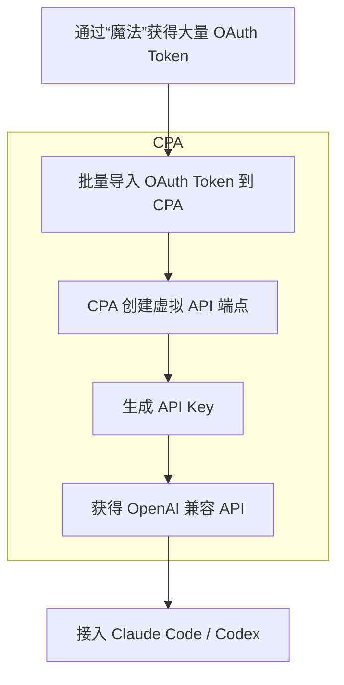

# 原理

# 实操

首先，获得“魔法”，获得大量 OAuth Token

安装 [router-for-me/CLIProxyAPI: Wrap Gemini CLI, Antigravity, ChatGPT Codex, Claude Code, Qwen Code, iFlow as an OpenAI/Gemini/Claude/Codex compatible API service, allowing you to enjoy the free Gemini 2.5 Pro, GPT 5, Claude, Qwen model through API](https://github.com/router-for-me/CLIProxyAPI)。前往 `/management.html` 

上传认证文件

添加 API Key

查看可用模型

导入 Claude Code

用

